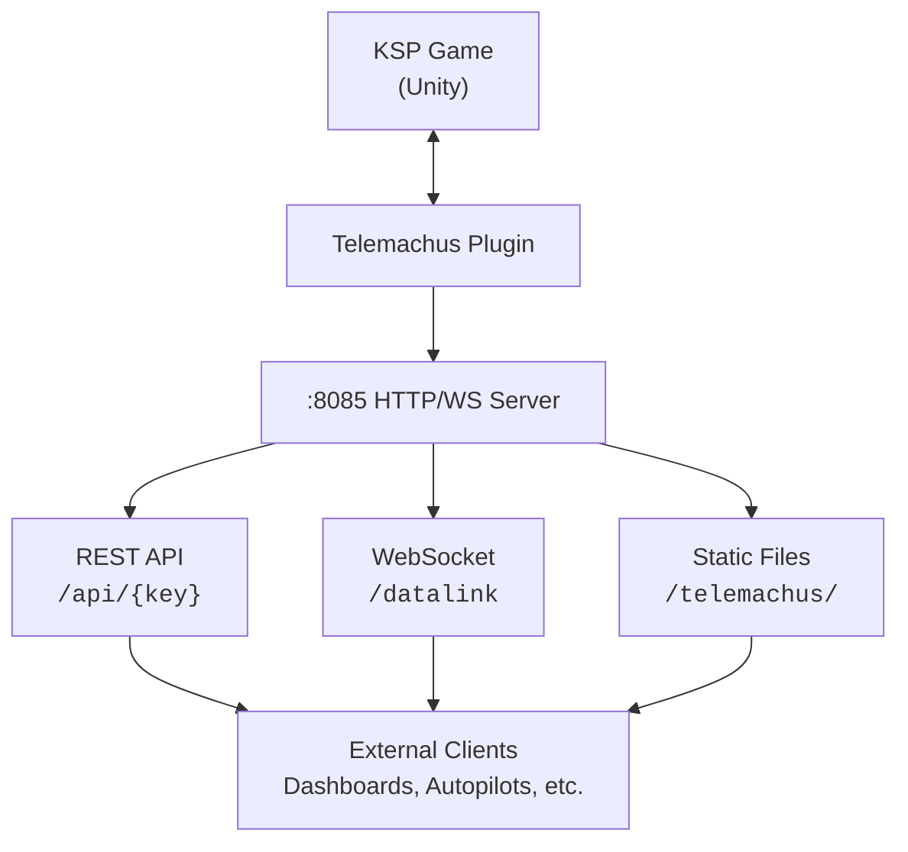

Telemachus Reborn is a KSP (Kerbal Space Program) plugin that exposes real-time telemetry and flight control over HTTP and WebSocket. It lets you build external dashboards, mission control interfaces, autopilots, and more.

## Features

- **400+ telemetry variables** — orbital mechanics, vessel state, navigation, resources, delta-V, and more
- **REST API** — `GET /api/v.altitude` returns `{ "v.altitude": 12500.0 }`
- **Batch queries** — `GET /telemachus/datalink?key1=v.altitude&key2=o.PeA` for multiple values at once
- **WebSocket streaming** — subscribe to variables at configurable rates
- **Flight control** — throttle, staging, SAS, RCS, action groups, fly-by-wire
- **Mod integrations** — FAR, MechJeb, RealChute, Astrogator, and more

## Architecture

Telemachus runs an embedded HTTP/WebSocket server inside KSP. When the game is running with a vessel loaded, external clients can connect on port `8085` (configurable) to read telemetry and send commands.

## Quick Start

1. Install the plugin (see [Installation](/Telemachus-1/guides/installation/))
2. Launch KSP and load a vessel
3. Open `http://localhost:8085` in your browser for the built-in dashboard
4. Or query the API directly: `curl http://localhost:8085/api/v.altitude`
